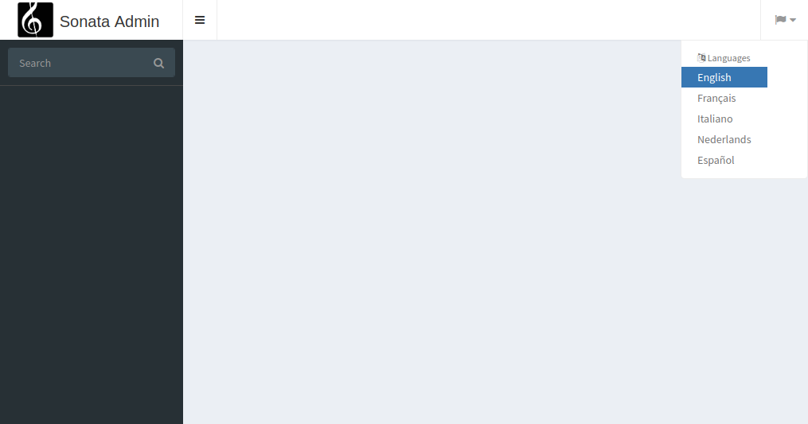

Global locale switcher
======================

``SonataTranslationBundle`` also provides a nice global locale switcher
for your admin.

Prerequisites
-------------

Install the following Sonata dependencies:

* `Sonata Intl Bundle`_

Configuration
-------------

Override the standard layout template with the one from the bundle:

.. code-block:: yaml

    # config/packages/sonata_admin.yaml

    sonata_admin:
        templates:
            layout: '@SonataTranslation/standard_layout.html.twig'

Configure route:

.. code-block:: yaml

    # config/routes.yaml

    sonata_translation:
        resource: '@SonataTranslationBundle/Resources/config/routes.yaml'

Enable ``locale_switcher``:

.. code-block:: yaml

    # config/packages/sonata_translation.yaml

    sonata_translation:
        locale_switcher: true

How it looks
------------

You are done and you probably want to know how this looks like in the admin
interface. Well, let's find out by going to `/admin`

.. _`Sonata Intl Bundle`: https://docs.sonata-project.org/projects/SonataIntlBundle/en/2.x/
