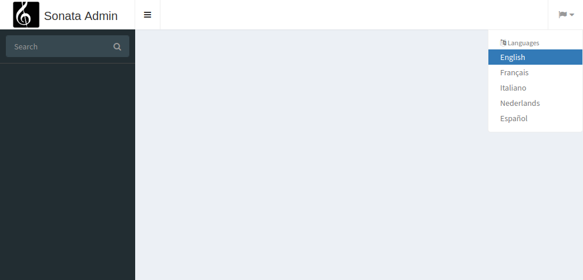

Global locale switcher
======================

``SonataTranslationBundle`` also provides a nice global locale switcher
for your admin.

Prerequisites
-------------

Install the following Sonata dependencies:

* `Sonata Intl Bundle`_

Configuration
-------------

Override standard layout template with the one from the bundle:

.. code-block:: yaml

    # app/config/packages/sonata_admin.yaml

    sonata_admin:
        ...
        templates:
            layout: '@SonataTranslation/standard_layout.html.twig'

Configure locale subscriber and user locale subscriber services:

.. code-block:: yaml

    # app/config/services.yaml

    services:
        ...
        Sonata\TranslationBundle\EventSubscriber\LocaleSubscriber:
            arguments: ['%kernel.default_locale%']
        Sonata\TranslationBundle\EventSubscriber\UserLocaleSubscriber:
            arguments: ~

Configure route:

.. code-block:: yaml

    # app/config/routes.yaml

    ...
    sonata_translation:
        resource: '@SonataTranslationBundle/Resources/config/routes.yaml'

How it looks
------------

You are done and you probably want to know how this looks like in the admin
interface. Well, let's find out by going to /admin

.. _`Sonata Intl Bundle`: https://sonata-project.org/bundles/intl
